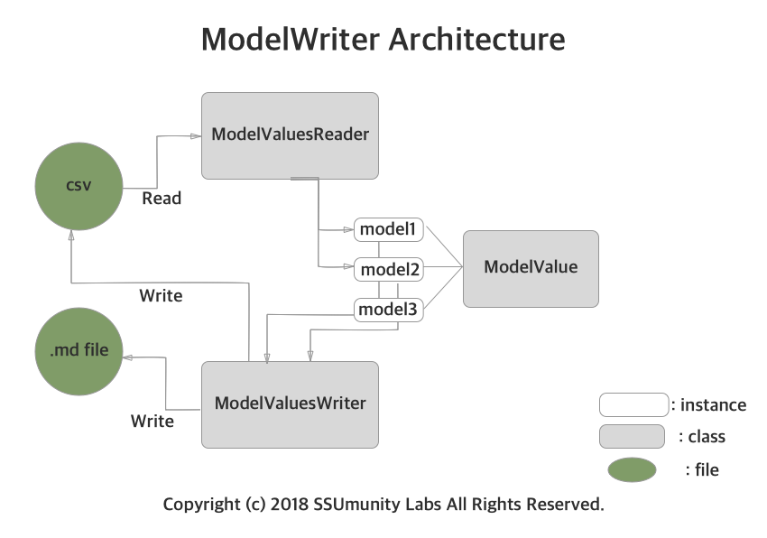

# [SSUmunity Labs](https://www.facebook.com/ai.ssumunity) - Model Value Writer

This repo is a module for handling DeepLearning model values
(accuracy, loss, etc...) based on csv and 'ModelValue' class.

## Install
~~~
> pip install model_writer
~~~

## Architecture

## Simple Use
~~~
from writer.model_writer import *

> mv1 = ModelValue("model1", {"accuracy": 0.7})
> mv2 = ModelValue("model2", {"accuracy": 0.3})

> mv1.set_value("loss",0.3)
> mv2.set_value("loss",0.64)

> writer = ModelValuesWriter([mv1, mv2], io_name='simple')
> writer.to_csv('./test.csv')
> writer.to_md('./README.md')
~~~
#### Result

|          |   model1 |   model2 |
|:---------|---------:|---------:|
| accuracy |      0.7 |     0.5  |
| loss     |      0.3 |     0.64 |

## ModelValue class
"ModelValue" is a class for some values of one model during training or eval.

#### Useage
You can handle this class like this.
~~~
from writer.model_writer import *

> mv1 = ModelValue("model1", {"accuracy": 0.7})
> mv2 = ModelValue("model2", {"loss": 0.3})

# use 'mv.set_value(value_name, value)' to add value in 'mv' instance.
> mv1.set_value("loss",0.3)
> mv2.set_value("accuracy",0.64)
~~~

## ModelWriter class
"ModelWriter" is a class for write to .md or .csv file with ModelValue classes.

#### Useage
You can handle this class like this.
~~~
> writer = ModelValuesWriter([mv1, mv2], io_name='writer')
> writer.to_csv('./test.csv') # save mv1, mv2 as csv file.
> writer.to_md('./README.md') # save mv1, mv2 as a chart in markdown file between "io_name" token.
~~~

#### Result
You can see the chart below is wrapped by "from_{io_name}" token in edit mode.

|          |   model1 |   model2 |
|:---------|---------:|---------:|
| accuracy |      0.7 |     0.5  |
| loss     |      0.3 |     0.64 |

## ModelReader class
"ModelReader" is a class for read from .csv file with ModelValue classes.

#### Useage
You can handle this class like this.
~~~
> reader = ModelValuesReader('./test.csv')
> mv1 = reader.search_model_value('model1')
> mv1.set_value('accuracy', 2)
>
> writer = ModelValuesWriter(reader.classes, io_name='reader')
> writer.to_csv('./test.csv') # save mv1, mv2 as csv file.
> writer.to_md('./README.md') # save mv1, mv2 as a chart in markdown file between "io_name" token.
~~~

#### Result

|          |   model1 |   model2 |
|:---------|---------:|---------:|
| accuracy |      2   |     0.5  |
| loss     |      0.3 |     0.64 |

## License
Project is published under the MIT licence. Feel free to clone and modify repo as you want, but don'y forget to add reference to authors :)
